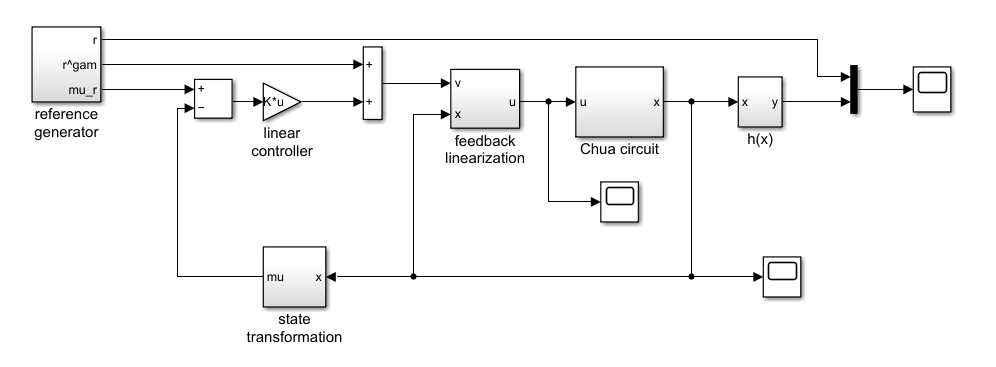
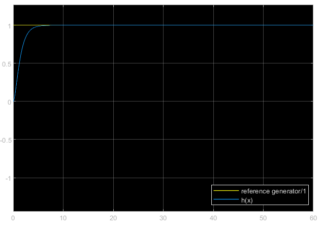

# Lab 02

Control of a nonlinear system through feedback linearization (FL). Once obtained a linearized system, I decided to apply a proportional gain.

The system successfully reached asyntotic stability to a constant value, which I deliberately chose as $1$.

