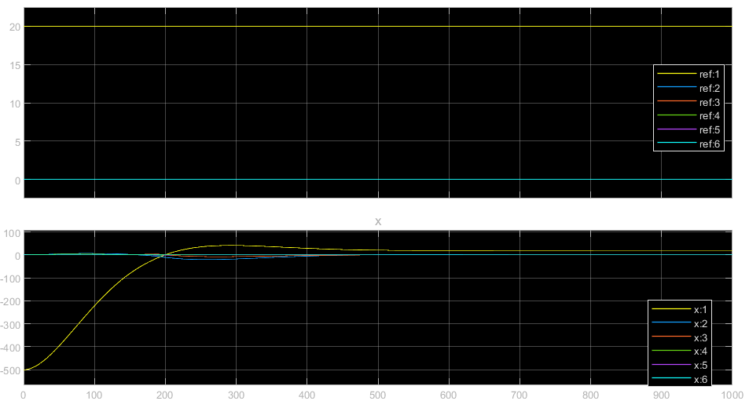
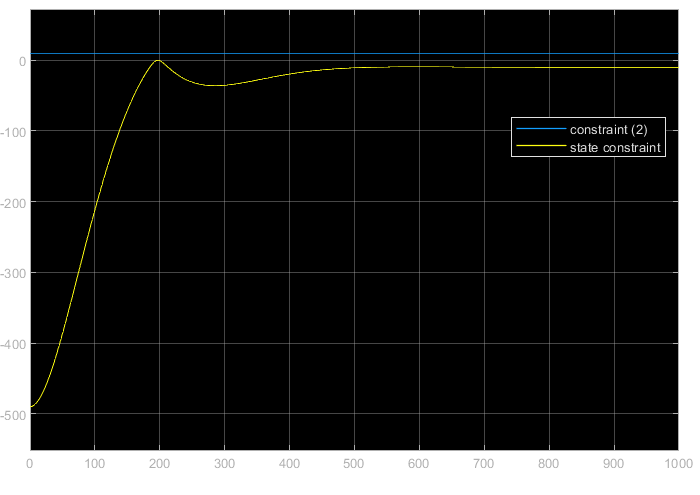
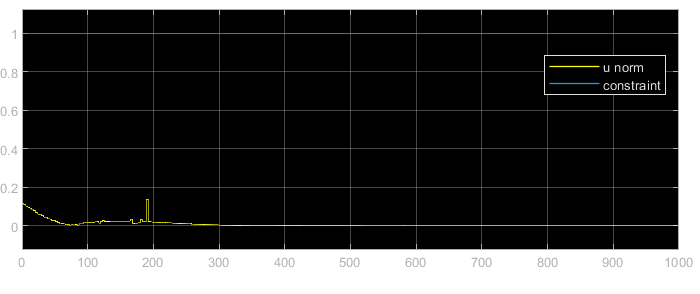
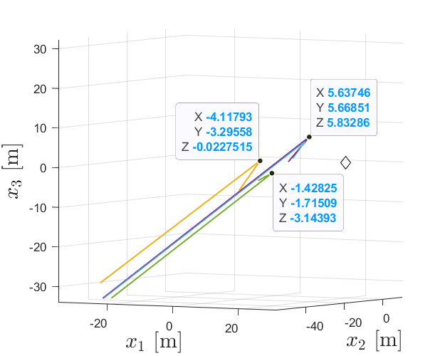

# Lab 04

Control of a linear system through Nonlinear Model Predictive Control (NMPC) block. Why? Because it's the first time doing it and we're doing something easy. Here's an overview of the whole scheme:


The (blue) NMPC block solves the optimization problem as stated in the theory. Since the system is linear, it behaves exactly like a standard MPC. The generated command $u$ is fed into a LTI whose output is the system state $x$, sent back to the NMPC through a feedback action. The computed state and command inputs are compared to their respective constraints. As seen in the graph below, the NMPC makes sure the system state successfully tracks the reference value (arbitraily chosen as $[20, 0, 0, 0, 0 ,0]$), given any initial condition $x_0$ (arbitraly chosen as $[500, 0, 0, 0, 0 ,0]$ ):



Both the command effort and state respect the given constraints





A bunch of other tests have been running, randomizing the initial conditions, which for this particular test the columns of the following matrix. $[x_1, x_2, x_3] \doteq [x, y, z]$

``` matlab
 -176.9250	-666.8390	-875.1062   -1000.00
   -4.1179	5.6375		-1.4283     4.803
   -7.8853	1.7509		-4.1568     2.601
    2.5399	-1.4953		-4.8960     -1.024
    1.4099	0.1144		-5.7820     -2.117
    0.1674	-1.3100		-2.6678     -4.003
```

The diamond is the reference position.


